# Bug Reports Documentation

## Описание  
Данный документ содержит список найденных мной багов на сайте **[https://guru.qahacking.ru/](https://guru.qahacking.ru/)**  
Полные баг-репорты были оформлены в **Jira**, однако здесь представлены:  
- краткое пояснение по каждому багу,  
- скриншоты,  
- ссылки на соответствующие баги.  

Документ структурирован с помощью оглавления и якорей для удобной навигации.  

## Оглавление
- [Bug 1: Ошибка при входе](#bug-1-ошибка-при-входе)
- [Bug 2: Кнопка не работает](#bug-2-кнопка-не-работает)
- [Bug 3: Краш приложения](#bug-3-краш-приложения)

# BugReport 1: Некорректное отображение текста
**Краткое описание:**  
Страница "О нас": Текст поверх изображения отображается некорректно.  

## Оформленный багрепорт (Скриншот из Jira):  

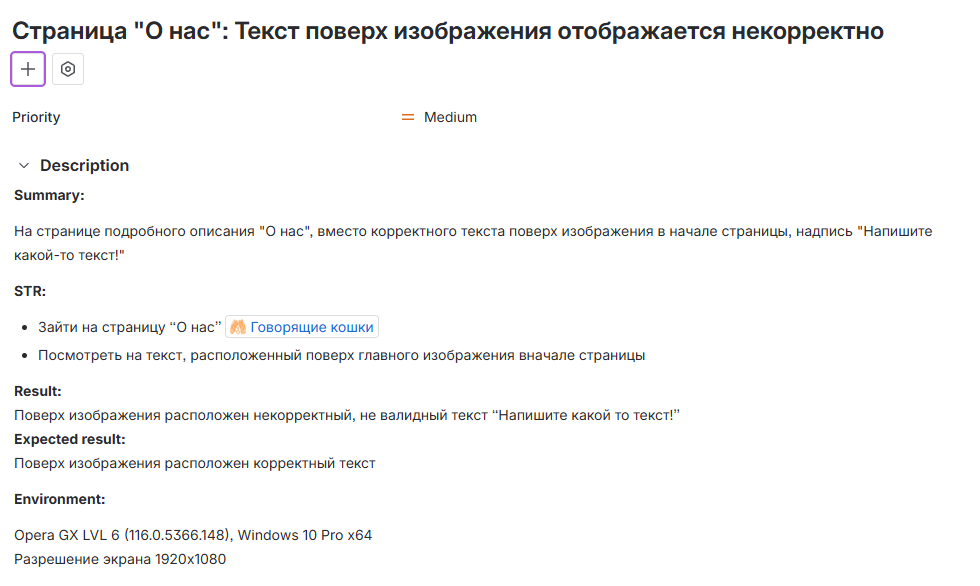  

## Приложение (реальный баг на сайте):  

  

---

# BugReport 2: Дублирование новостной ленты

## Оформленный багрепорт (Скриншот из Jira):  

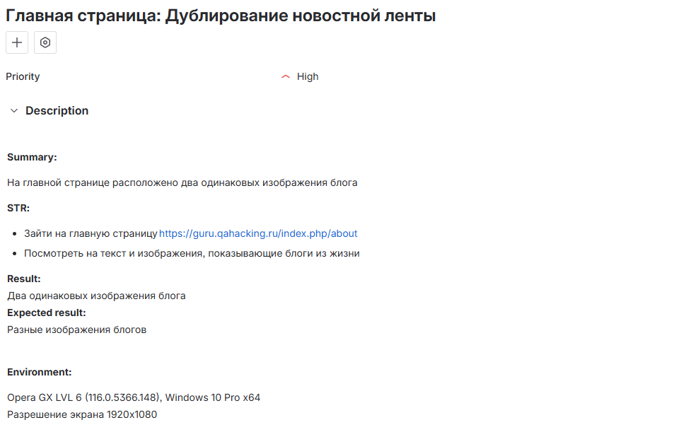  

## Приложение (реальный баг на сайте):  

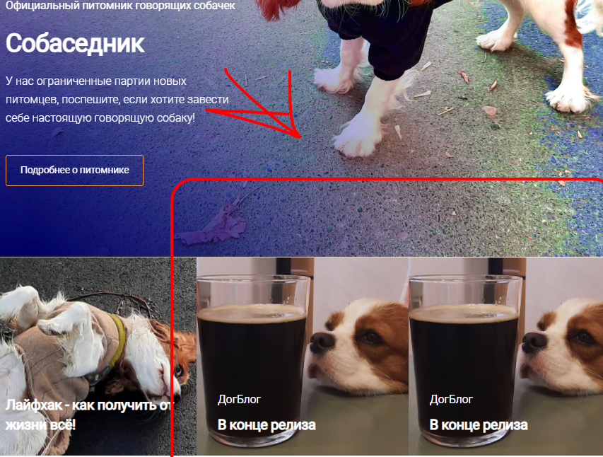  

---

# BugReport 3: Главная страница: Кнопка "Send" не отображается пока не наведен курсор

## Оформленный багрепорт (Скриншот из Jira):  

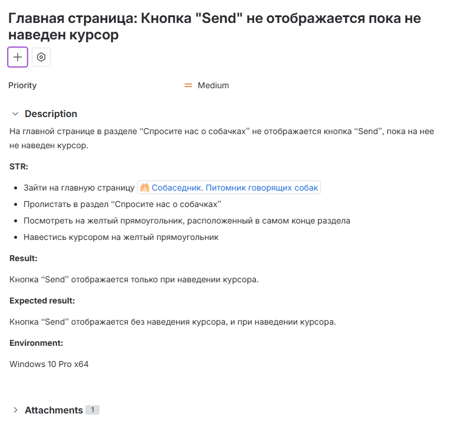  

## Приложение (реальный баг на сайте):  

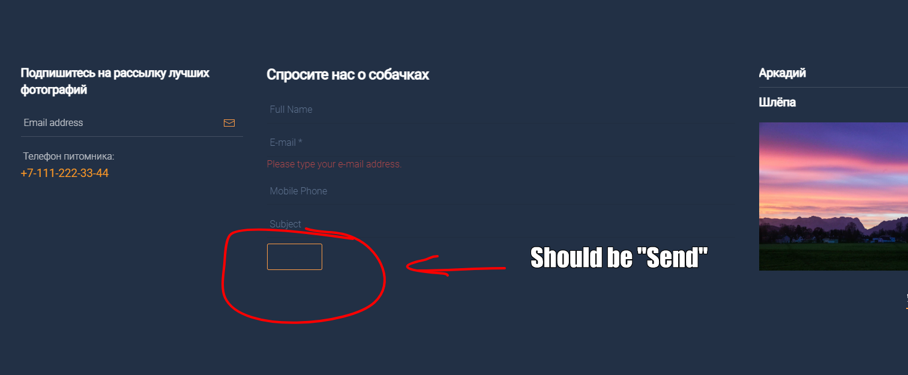  

---

# BugReport 4: Футер - Невозможно подписаться на рассылку

## Оформленный багрепорт (Скриншот из Jira):  

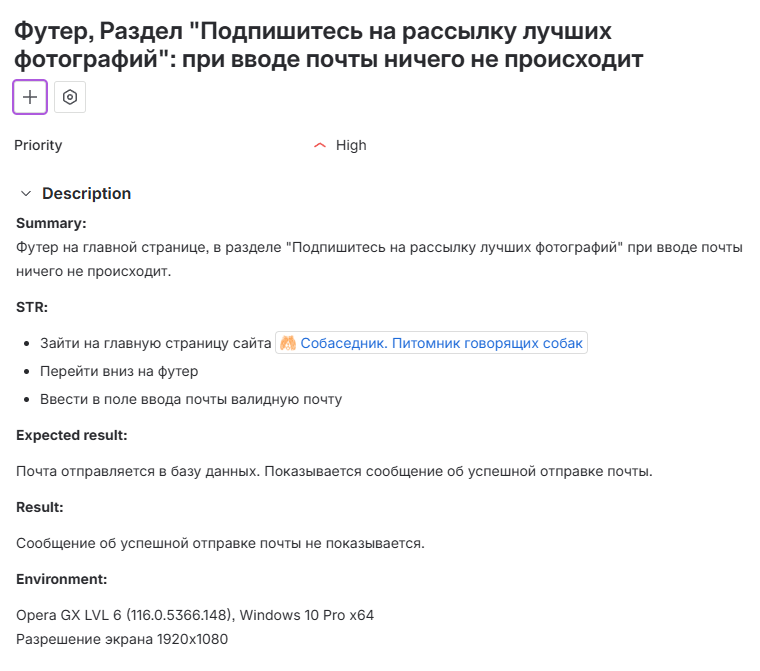  

## Приложение (реальный баг на сайте):  

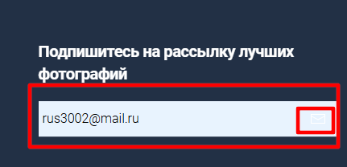  

---

# BugReport 5: Не отображается изображение карусели

## Оформленный багрепорт (Скриншот из Jira):  

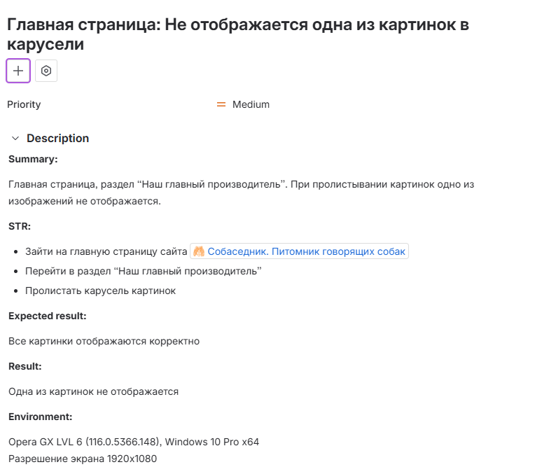  

## Приложение (реальный баг на сайте):  

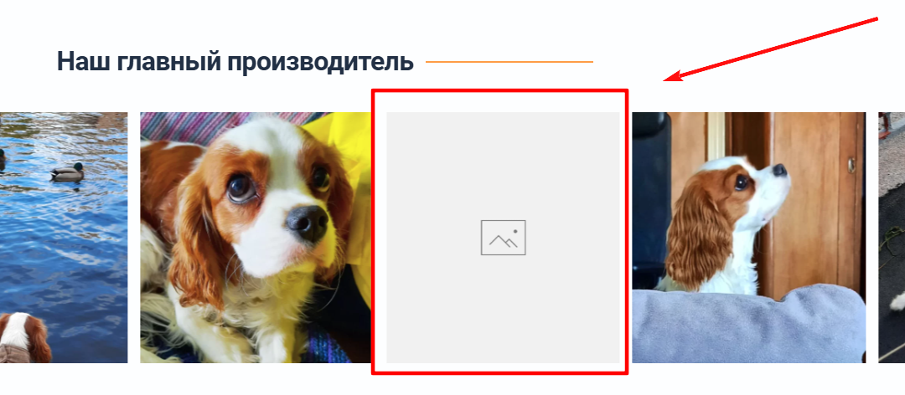  

---

# BugReport 6: Нет возможности ввести номер телефона

## Оформленный багрепорт (Скриншот из Jira):  

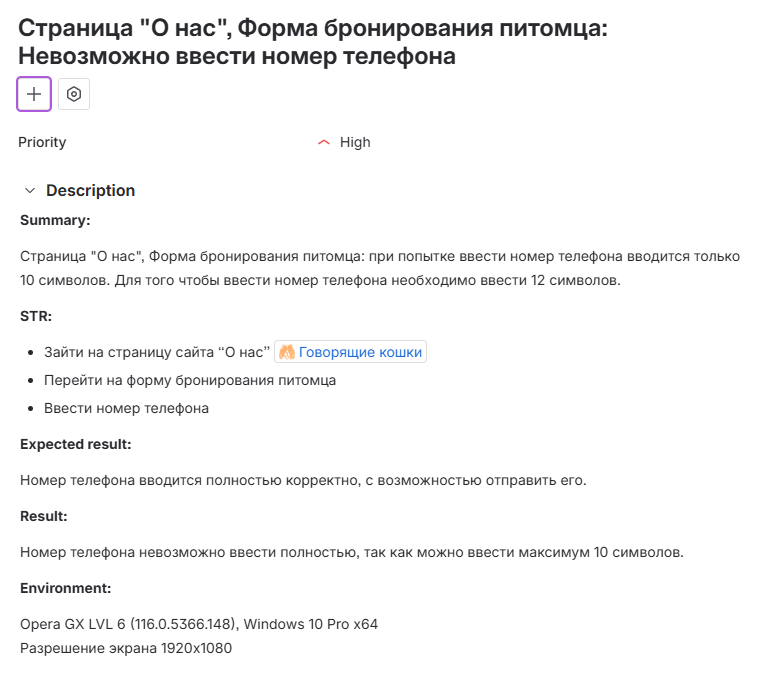  

## Приложение (реальный баг на сайте):  

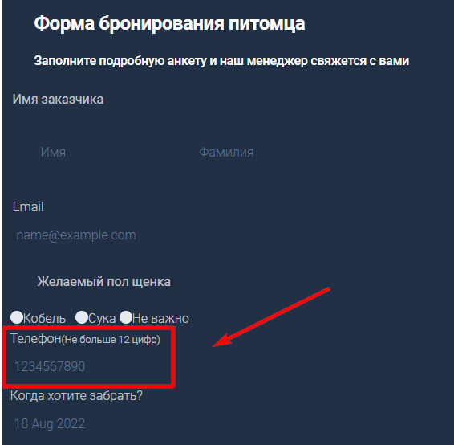  

---

# BugReport 7: Поле ввода "Особые пожелания" не отображается

## Оформленный багрепорт (Скриншот из Jira):  

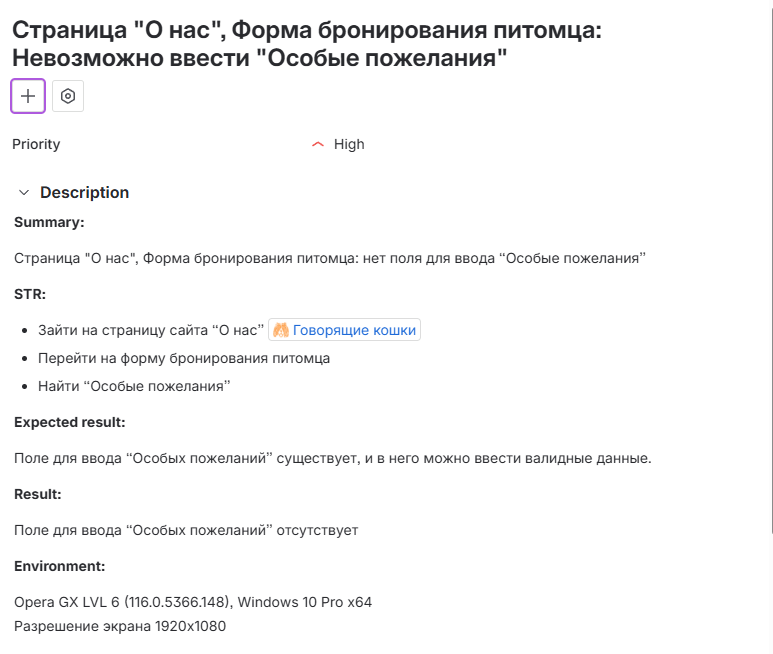  

## Приложение (реальный баг на сайте):  

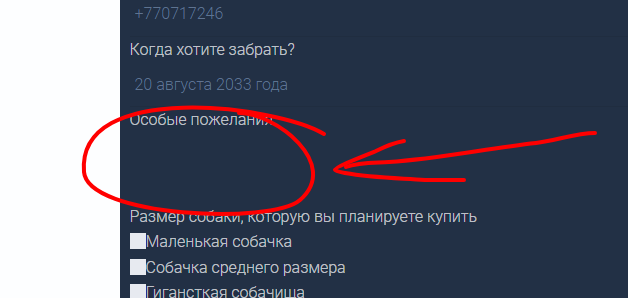  

---

# BugReport 8: Некорректная кнопка радио-кнопки - возможно выбрать все варианты

## Оформленный багрепорт (Скриншот из Jira):  

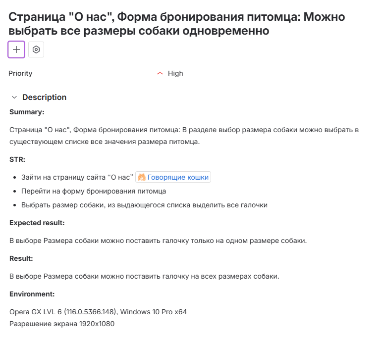  

## Приложение (реальный баг на сайте):  

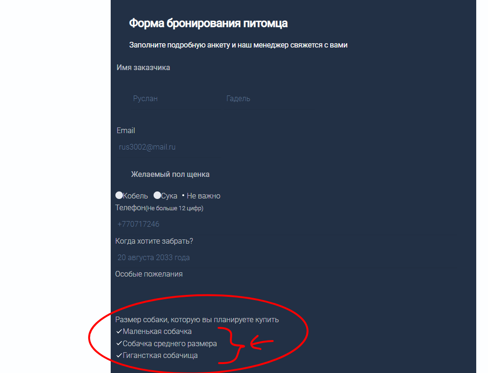  

---

# BugReport 9: Отсутствует поле ввода или выпадающий список

## Оформленный багрепорт (Скриншот из Jira):  

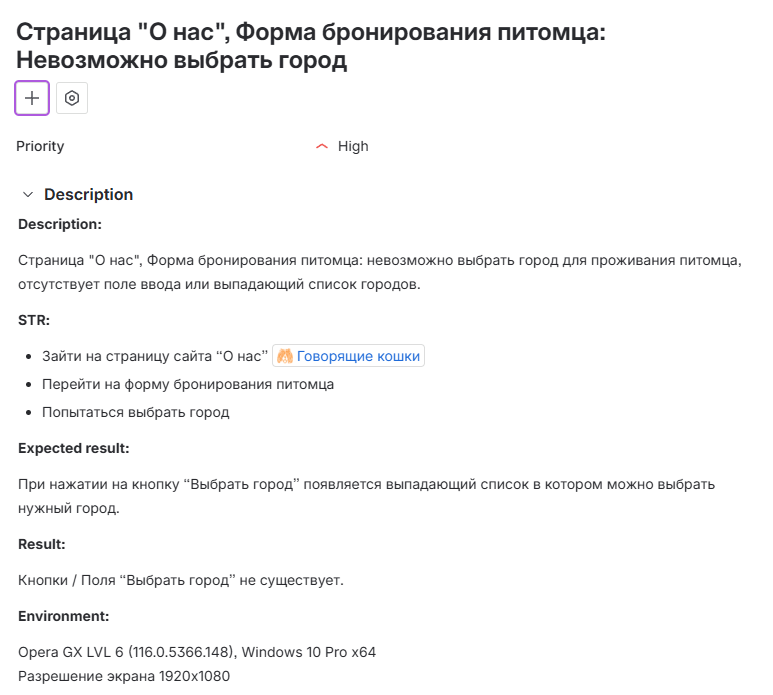  

## Приложение (реальный баг на сайте):  

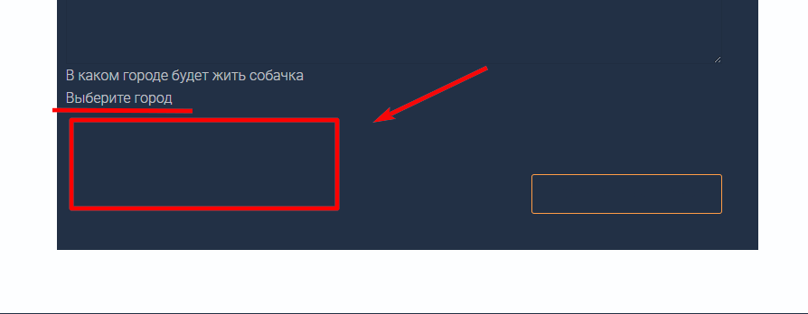  

---

# BugReport 10: Текст кнопки не в футере отображается без наведения

## Оформленный багрепорт (Скриншот из Jira):  

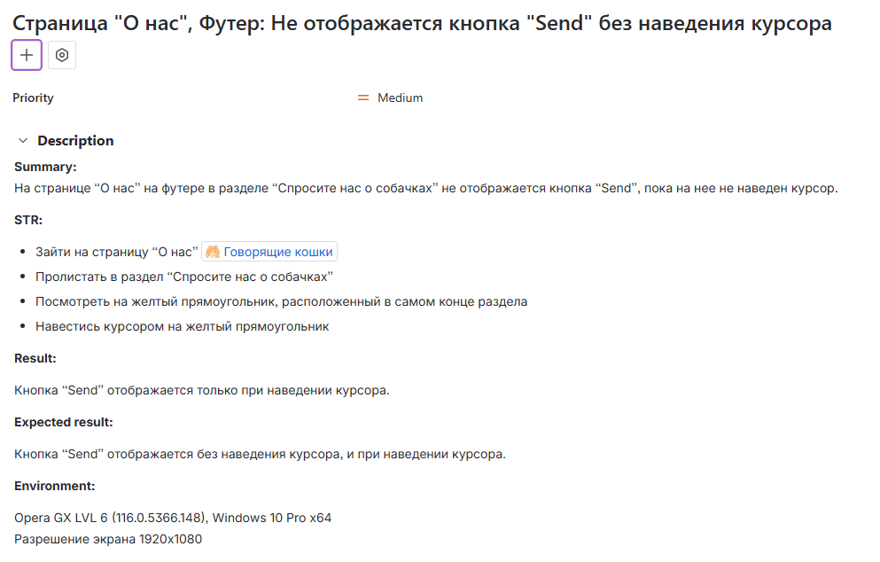  

## Приложение (реальный баг на сайте):  

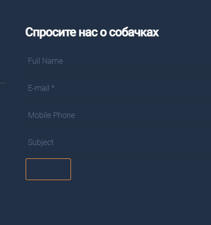

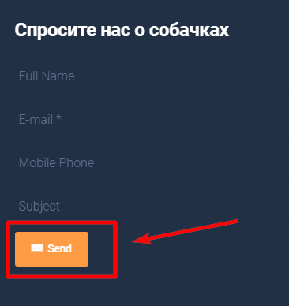  

---

# BugReport 11: Текст кнопки не отображается без наведения

## Оформленный багрепорт (Скриншот из Jira):  

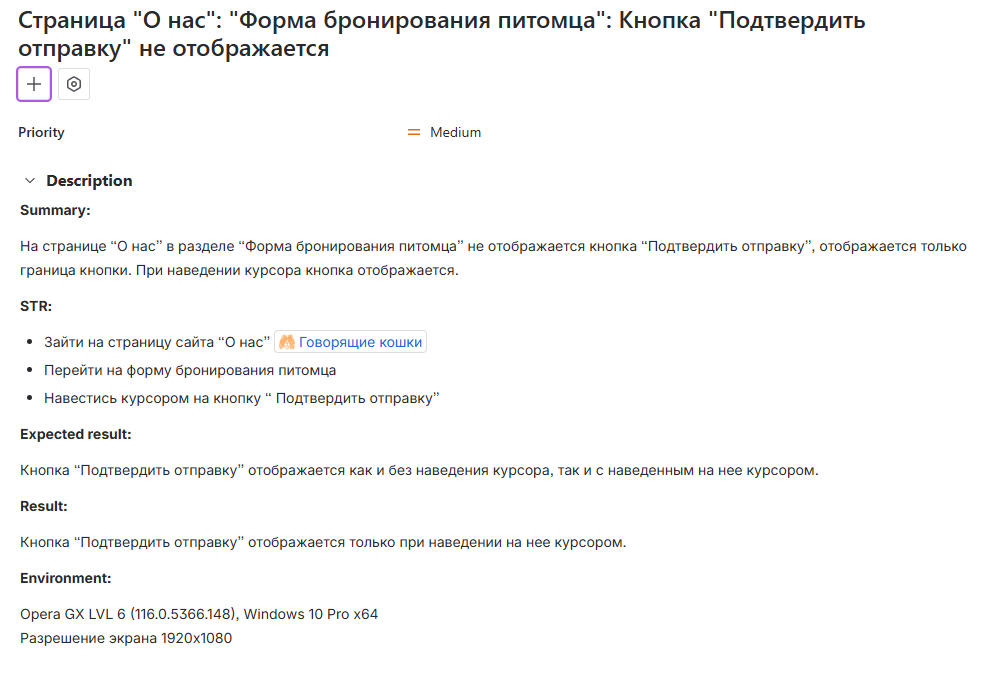  

## Приложение (реальный баг на сайте):  

.png)  

.png)  

---
