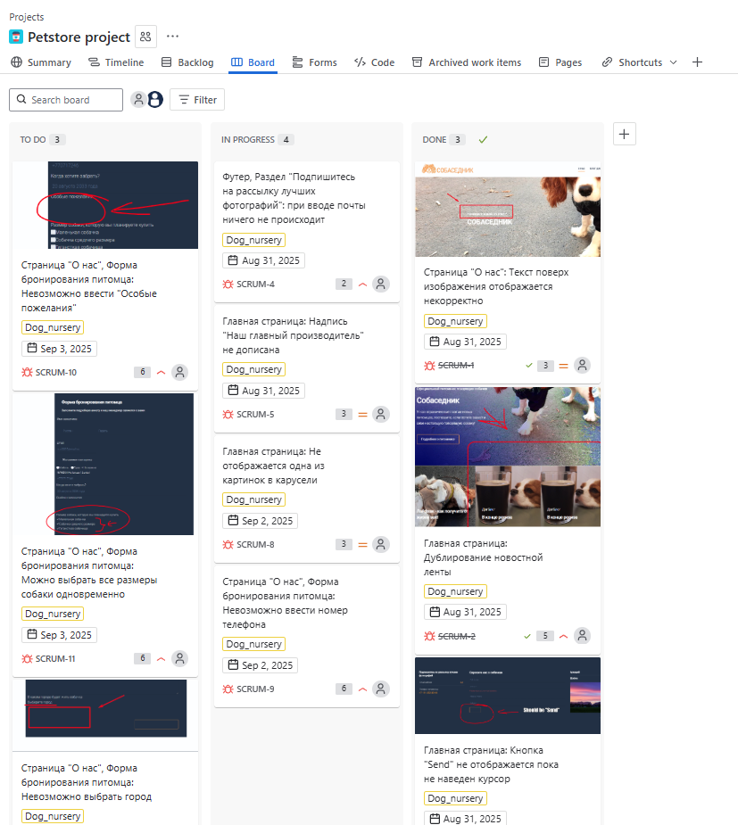

# Sprint Board
## Описание  

Данный документ содержит скриншот **доски спринта** в Jira.  

На изображении отражено:  
- распределение задач по колонкам (**To Do**, **In Progress**, **Done**),  
- текущее состояние выполнения спринта,  
- визуальное отображение прогресса команды,  
- статус и приоритет каждой задачи.  

Документ позволяет наглядно продемонстрировать ход работы по спринту и текущее распределение задач между статусами.

  